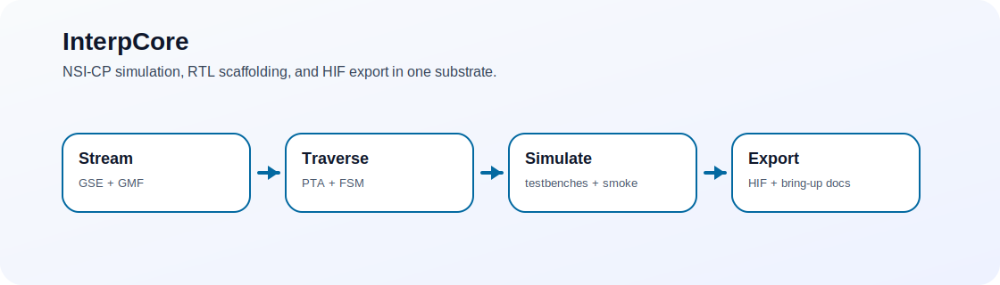

# InterpCore
> NSI-CP runtime substrate for graph streaming, traversal, simulation, RTL bring-up, and HIF export.

   

InterpCore exists because higher-order interpretability needs an execution substrate once the objects of interest are streams, hyperedges, traversals, and exportable graphs rather than isolated scalar features.



## 60-second demo
```bash
cargo build
cargo run
```

Expected behavior:
- prints readiness information
- processes synthetic activations
- discovers at least one hyperedge through the current dummy-oracle path
- prints a minimal HIF JSON export

## Choose your path
- I want the software substrate: [60-second demo](#60-second-demo) · [Profiles and configuration](#profiles-and-configuration)
- I want the hardware path: [Repository map](#repository-map) · [RTL bring-up](docs/RTL_README.md)
- I want simulations: [simulation README](sim/README.md)
- I want to contribute: [Status](#status) · [Testing](#testing)

## Why this exists
Mechanism discovery becomes a systems problem surprisingly fast. InterpCore is the repo where graph streaming, traversal acceleration, subgraph mining, memory fabric ideas, and HIF export can be reasoned about together.

## What this is / isn't
✅ Is: a single-crate Rust simulation plus RTL/FPGA scaffolding for the NSI-CP story  
✅ Is: a substrate for testing how hypergraph-oriented interpretability might run  
❌ Isn't: a finished silicon program or production engine  
❌ Isn't: a polished end-user interpretability app

## Repository map
- `src/`: Rust simulation of GSE, PTA, FSM, GMF, and HIF export
- `sim/`: simulation scaffolding and smoke testbenches
- `hw/`: RTL stubs and integration surfaces
- `fpga/`: board wrappers and constraints
- `docs/`: bring-up and hardware notes

## Profiles and configuration
Profile selection order:
1. CLI flag: `--profile openai|anthropic`
2. env var: `NSICP_PROFILE=openai|anthropic`
3. cargo features: `--features openai` or `--features anthropic`
4. default: `anthropic`

Useful overrides:
- `NSICP_STII_THRESHOLD`
- `NSICP_MAX_K`
- `NSICP_PTA_SAMPLE_COUNT`
- `NSICP_ACT_CAP`
- `NSICP_CAND_CAP`

## Testing
```bash
cargo test
```
Simulation and bring-up docs:
- [sim/README.md](sim/README.md)
- [docs/RTL_README.md](docs/RTL_README.md)
- [docs/FPGA_BRINGUP.md](docs/FPGA_BRINGUP.md)

## Status
- The software simulation is the most concrete surface.
- The RTL tree is scaffolding for bring-up and integration planning.
- HIF export is intentionally minimal and oriented toward early validation.
